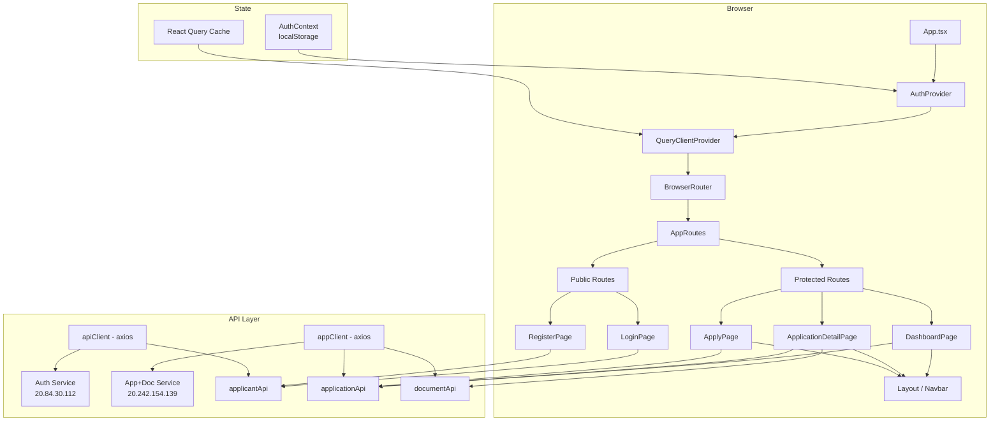
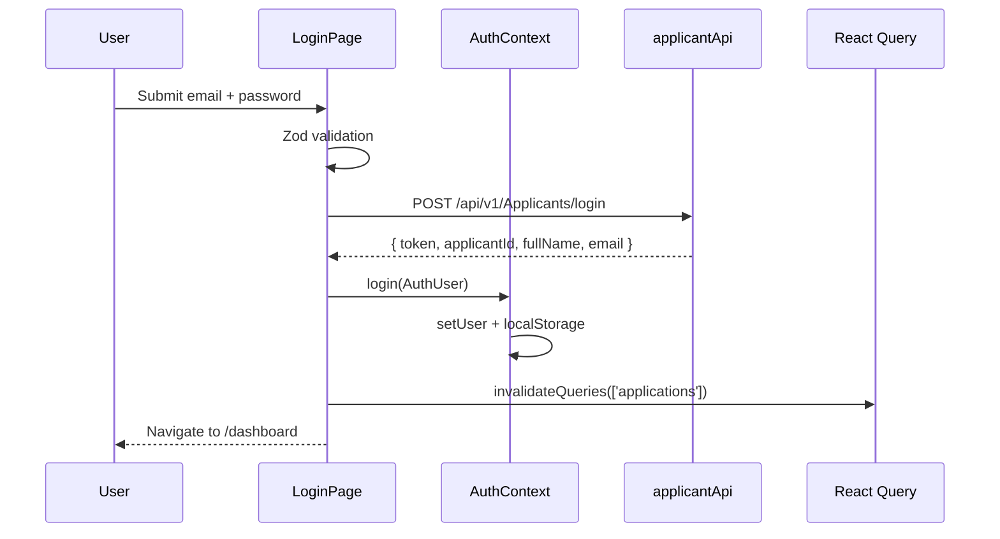
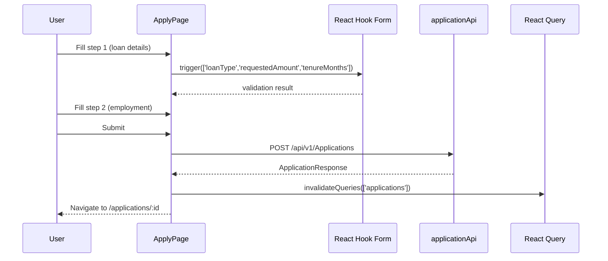
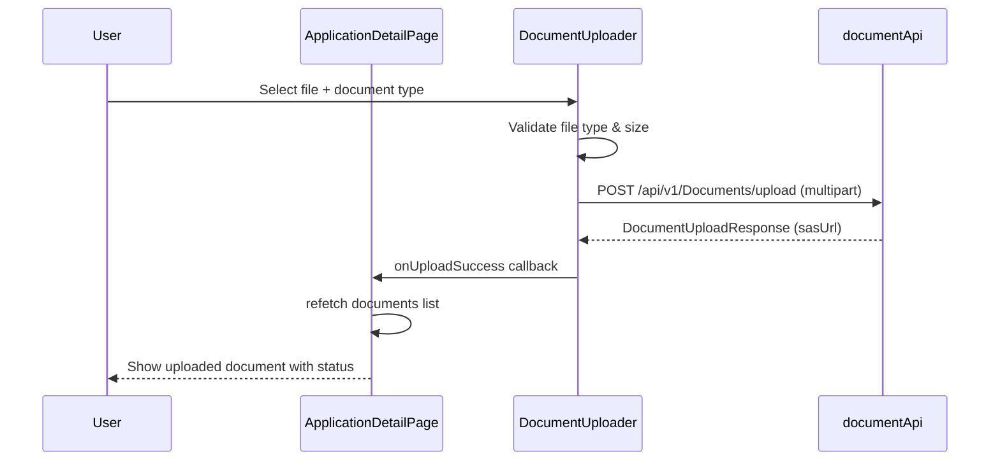

# Design Document: React Loan Portal (LADVS)

## Overview

The LADVS (Loan Application & Document Verification System) portal is a React 18 + TypeScript single-page application that lets applicants register, authenticate, submit loan applications, upload supporting documents, and track application status through a multi-step workflow. The frontend communicates with two separate backend microservices — an applicant/auth service and an application/document service — via Axios with JWT bearer tokens managed through a shared auth context.

The portal is structured around four core user journeys: onboarding (register/login), dashboard (view all applications), application submission (multi-step form), and application detail (status tracking + document upload). All pages are protected by route-level authentication guards, and all server state is managed through React Query v5 with optimistic updates where appropriate.

## Architecture



## Sequence Diagrams

### Login Flow



### Multi-Step Application Submission



### Document Upload Flow



## Components and Interfaces

### Layout: `AppLayout`

**Purpose**: Shared shell for all authenticated pages — top navbar with user info, logout, and navigation links.

**Interface**:
```typescript
interface AppLayoutProps {
  children: React.ReactNode
}
```

**Responsibilities**:
- Render persistent navbar with brand, user name, and logout button
- Provide consistent page padding/max-width container
- Show active route indicator in nav links

---

### Page: `DashboardPage`

**Purpose**: Lists all loan applications for the authenticated applicant with status badges and quick navigation.

**Interface**:
```typescript
// No props — reads from AuthContext and React Query
// Route: /dashboard
```

**Responsibilities**:
- Fetch `GET /api/v1/Applications` via `useQuery(['applications'])`
- Render empty state with CTA when no applications exist
- Map status strings to color-coded badges
- Navigate to `/applications/:id` on card click
- Navigate to `/apply` via "New Application" button

---

### Page: `ApplyPage`

**Purpose**: Multi-step form for creating a new loan application.

**Interface**:
```typescript
// No props — reads applicantId from AuthContext
// Route: /apply
```

**Responsibilities**:
- Step 1: Loan details (loanType, requestedAmount, tenureMonths)
- Step 2: Employment details (employmentType, companyName, monthlyIncome)
- Validate each step with Zod before advancing
- Submit via `applicationApi.create()` with applicant data from AuthContext
- On success: navigate to `/applications/:id` and invalidate `['applications']` cache

---

### Page: `ApplicationDetailPage`

**Purpose**: Shows full details of a single application, its current status timeline, and document upload/management.

**Interface**:
```typescript
// No props — reads :id from useParams()
// Route: /applications/:id
```

**Responsibilities**:
- Fetch `GET /api/v1/Applications/:id` via `useQuery(['application', id])`
- Fetch `GET /api/v1/Documents/:id` via `useQuery(['documents', id])`
- Render application summary card (loan type, amount, tenure, status)
- Render status timeline component
- Render document upload section per required document type
- Show uploaded documents with download links (sasUrl)

---

### Component: `StatusBadge`

**Purpose**: Reusable pill badge that maps application status strings to Tailwind color classes.

**Interface**:
```typescript
interface StatusBadgeProps {
  status: 'Submitted' | 'UnderReview' | 'Approved' | 'Rejected' | 'DocumentsPending'
  size?: 'sm' | 'md'
}
```

---

### Component: `DocumentUploader`

**Purpose**: File input + upload button for a single document type, with progress feedback.

**Interface**:
```typescript
interface DocumentUploaderProps {
  applicationId: string
  applicantId: string
  documentType: string
  label: string
  acceptedTypes?: string        // e.g. ".pdf,.jpg,.png"
  maxSizeMB?: number            // default: 5
  existingDocument?: DocumentUploadResponse | null
  onUploadSuccess: (doc: DocumentUploadResponse) => void
}
```

**Responsibilities**:
- Validate file type and size before upload
- Show upload progress state (idle → uploading → success/error)
- Display existing document name + download link if already uploaded
- Call `documentApi.upload()` and invoke `onUploadSuccess` on completion

---

### Component: `LoanSummaryCard`

**Purpose**: Compact card showing key loan application fields.

**Interface**:
```typescript
interface LoanSummaryCardProps {
  application: ApplicationResponse
  onClick?: () => void
}
```

---

### Component: `StepIndicator`

**Purpose**: Visual progress bar for multi-step forms.

**Interface**:
```typescript
interface StepIndicatorProps {
  totalSteps: number
  currentStep: number
  labels?: string[]
}
```

---

### Hook: `useApplications`

**Purpose**: Encapsulates React Query logic for fetching the applications list.

**Interface**:
```typescript
function useApplications(): {
  applications: ApplicationResponse[]
  isLoading: boolean
  isError: boolean
  refetch: () => void
}
```

---

### Hook: `useApplication`

**Purpose**: Fetches a single application by ID.

**Interface**:
```typescript
function useApplication(id: number): {
  application: ApplicationResponse | undefined
  isLoading: boolean
  isError: boolean
}
```

---

### Hook: `useDocuments`

**Purpose**: Fetches documents for a given application ID.

**Interface**:
```typescript
function useDocuments(applicationId: string): {
  documents: DocumentUploadResponse[]
  isLoading: boolean
  refetch: () => void
}
```

---

### Hook: `useCreateApplication`

**Purpose**: Wraps `applicationApi.create()` in a React Query mutation with cache invalidation.

**Interface**:
```typescript
function useCreateApplication(): {
  mutate: (data: CreateApplicationRequest) => void
  mutateAsync: (data: CreateApplicationRequest) => Promise<ApplicationResponse>
  isPending: boolean
  isError: boolean
  error: AxiosError | null
}
```

## Data Models

### `AuthUser`

```typescript
interface AuthUser {
  applicantId: string   // UUID from backend
  fullName: string
  email: string
  token: string         // JWT bearer token
}
```

**Validation Rules**:
- `token` must be present for authenticated routes
- Persisted to `localStorage` under key `ladvs_user`; token separately under `ladvs_token`

---

### `ApplicationResponse`

```typescript
interface ApplicationResponse {
  id: number
  applicationNumber: string   // e.g. "APP-2024-001"
  applicantName: string
  loanType: 'Personal' | 'Home' | 'Car' | 'Business' | 'Education'
  requestedAmount: number     // in INR, minimum 10,000
  tenureMonths: number        // 1–360
  status: ApplicationStatus
  createdAt: string           // ISO 8601
}

type ApplicationStatus =
  | 'Submitted'
  | 'UnderReview'
  | 'DocumentsPending'
  | 'Approved'
  | 'Rejected'
```

---

### `CreateApplicationRequest`

```typescript
interface CreateApplicationRequest {
  applicantId: string
  applicantName: string
  applicantEmail: string
  applicantPhone: string
  loanType: string
  requestedAmount: number
  tenureMonths: number
  employmentType: string
  companyName: string
  monthlyIncome: number
}
```

**Validation Rules** (Zod schema):
- `requestedAmount` ≥ 10,000
- `tenureMonths` between 1 and 360
- `monthlyIncome` > 0
- `loanType` must be one of the five supported types

---

### `DocumentUploadResponse`

```typescript
interface DocumentUploadResponse {
  id: string
  applicationId: string
  documentType: string    // e.g. "Aadhaar", "PAN", "Salary Slip", "Bank Statement"
  fileName: string
  fileSize: number        // bytes
  status: 'Uploaded' | 'Verified' | 'Rejected'
  sasUrl: string          // Azure Blob SAS URL for download
  uploadedAt: string      // ISO 8601
}
```

---

### `ApiResponse<T>` (wrapper)

```typescript
interface ApiResponse<T> {
  success: boolean
  statusCode: number
  data: T
  error: string | null
  service: string
  timestamp: string
}
```

## Algorithmic Pseudocode

### Multi-Step Form Validation Algorithm

```typescript
// ApplyPage step advancement
async function advanceStep(
  currentStep: number,
  trigger: UseFormTrigger<ApplicationForm>
): Promise<boolean> {
  const fieldsByStep: Record<number, (keyof ApplicationForm)[]> = {
    1: ['loanType', 'requestedAmount', 'tenureMonths'],
    2: ['employmentType', 'companyName', 'monthlyIncome'],
  }

  const fieldsToValidate = fieldsByStep[currentStep]
  if (!fieldsToValidate) return true

  const isValid = await trigger(fieldsToValidate)
  return isValid
}
```

**Preconditions**:
- `currentStep` is a valid step index (1 or 2)
- `trigger` is the React Hook Form trigger function bound to the form

**Postconditions**:
- Returns `true` only if all fields for the current step pass Zod validation
- Form errors are populated in the RHF error state for display
- Step does not advance if validation fails

---

### Document Upload Algorithm

```typescript
async function uploadDocument(
  file: File,
  applicationId: string,
  applicantId: string,
  documentType: string,
  maxSizeMB: number
): Promise<DocumentUploadResponse> {
  // Precondition checks
  const allowedTypes = ['application/pdf', 'image/jpeg', 'image/png']
  if (!allowedTypes.includes(file.type)) {
    throw new Error('Invalid file type. Only PDF, JPG, PNG allowed.')
  }
  if (file.size > maxSizeMB * 1024 * 1024) {
    throw new Error(`File exceeds ${maxSizeMB}MB limit.`)
  }

  // Upload
  const result = await documentApi.upload(applicationId, applicantId, documentType, file)

  if (!result.success) {
    throw new Error(result.error ?? 'Upload failed')
  }

  return result.data
}
```

**Preconditions**:
- `file` is a valid File object selected by the user
- `applicationId` and `applicantId` are non-empty strings
- `maxSizeMB` is a positive number

**Postconditions**:
- Returns `DocumentUploadResponse` with a valid `sasUrl` on success
- Throws descriptive error on type/size violation or API failure
- No partial uploads — either fully succeeds or throws

---

### Auth Token Refresh / 401 Handling Algorithm

```typescript
// In apiClient interceptor (response)
function handle401(error: AxiosError): never {
  if (error.response?.status === 401) {
    localStorage.removeItem('ladvs_token')
    localStorage.removeItem('ladvs_user')
    window.location.href = '/login'
  }
  return Promise.reject(error)
}
```

**Preconditions**:
- Interceptor is registered on both `apiClient` and `appClient`

**Postconditions**:
- On 401: clears all auth state from localStorage and redirects to `/login`
- On other errors: passes error through to calling code unchanged

**Loop Invariants**: N/A (no loops)

---

### Route Protection Algorithm

```typescript
function ProtectedRoute({ children }: { children: React.ReactNode }): JSX.Element {
  const { isAuthenticated } = useAuth()
  // isAuthenticated = !!user, where user is hydrated from localStorage on mount
  return isAuthenticated ? <>{children}</> : <Navigate to="/login" replace />
}
```

**Preconditions**:
- `AuthProvider` wraps the component tree above `BrowserRouter`
- `useAuth()` returns a non-null context

**Postconditions**:
- Authenticated users see the protected page
- Unauthenticated users are redirected to `/login` with `replace` (no back-navigation to protected route)

## Key Functions with Formal Specifications

### `applicationApi.create()`

```typescript
async function create(data: CreateApplicationRequest): Promise<ApiResponse<ApplicationResponse>>
```

**Preconditions**:
- `data.requestedAmount >= 10000`
- `data.tenureMonths` ∈ [1, 360]
- `data.monthlyIncome > 0`
- Valid JWT token present in `localStorage`

**Postconditions**:
- On success: `result.success === true` and `result.data.id` is a positive integer
- On auth failure: interceptor redirects to `/login` before promise resolves
- On validation failure: `result.success === false` and `result.error` is non-null

---

### `documentApi.upload()`

```typescript
async function upload(
  applicationId: string,
  applicantId: string,
  documentType: string,
  file: File
): Promise<ApiResponse<DocumentUploadResponse>>
```

**Preconditions**:
- `applicationId` and `applicantId` are non-empty UUIDs
- `file.size <= 5 * 1024 * 1024` (5 MB)
- `file.type` ∈ `['application/pdf', 'image/jpeg', 'image/png']`

**Postconditions**:
- On success: `result.data.sasUrl` is a valid HTTPS URL
- `result.data.status === 'Uploaded'`
- File is stored in Azure Blob Storage; `sasUrl` is time-limited

---

### `useAuth().login()`

```typescript
function login(userData: AuthUser): void
```

**Preconditions**:
- `userData.token` is a non-empty JWT string
- `userData.applicantId` is a non-empty string

**Postconditions**:
- `user` state is set to `userData`
- `localStorage['ladvs_user']` = `JSON.stringify(userData)`
- `localStorage['ladvs_token']` = `userData.token`
- `isAuthenticated` becomes `true`

**Loop Invariants**: N/A

## Example Usage

```typescript
// 1. Protecting a route
<Route path="/dashboard" element={
  <ProtectedRoute>
    <DashboardPage />
  </ProtectedRoute>
} />

// 2. Fetching applications in a component
const { applications, isLoading } = useApplications()

// 3. Creating an application with mutation
const { mutateAsync, isPending } = useCreateApplication()

const onSubmit = async (formData: ApplicationForm) => {
  const { applicantId, fullName, email } = user!
  const result = await mutateAsync({
    applicantId,
    applicantName: fullName,
    applicantEmail: email,
    applicantPhone: formData.phone,
    loanType: formData.loanType,
    requestedAmount: formData.requestedAmount,
    tenureMonths: formData.tenureMonths,
    employmentType: formData.employmentType,
    companyName: formData.companyName,
    monthlyIncome: formData.monthlyIncome,
  })
  navigate(`/applications/${result.id}`)
}

// 4. Uploading a document
const handleFileChange = async (e: React.ChangeEvent<HTMLInputElement>) => {
  const file = e.target.files?.[0]
  if (!file) return
  try {
    const doc = await uploadDocument(file, applicationId, applicantId, 'PAN', 5)
    onUploadSuccess(doc)
    toast.success('Document uploaded successfully')
  } catch (err: any) {
    toast.error(err.message)
  }
}
```

## Correctness Properties

- For all authenticated routes: if `localStorage['ladvs_token']` is absent or expired, the user is redirected to `/login` before any protected page renders
- For all form submissions: Zod validation runs client-side before any API call is made; no API call is issued with invalid data
- For all React Query queries: stale data is never shown without a loading indicator; errors surface via `isError` state
- For all document uploads: file type and size are validated before the multipart request is sent; invalid files never reach the API
- For all `ApiResponse<T>` responses: `result.success === false` always results in a user-visible toast error; the UI never silently swallows API errors
- For all `logout()` calls: both `ladvs_user` and `ladvs_token` are removed from localStorage atomically before navigation

## Error Handling

### Scenario 1: Network / API Unavailable

**Condition**: Axios request times out or returns a network error  
**Response**: React Query marks the query as `isError: true`; component renders an error state with a retry button  
**Recovery**: User clicks retry; React Query re-fetches automatically on window focus (default behavior)

### Scenario 2: 401 Unauthorized

**Condition**: JWT token is expired or invalid; backend returns 401  
**Response**: Axios response interceptor clears localStorage and redirects to `/login`  
**Recovery**: User re-authenticates; React Query cache is cleared on logout

### Scenario 3: Form Validation Failure

**Condition**: User submits a form step with invalid data  
**Response**: Zod resolver populates `formState.errors`; inline error messages appear below each field; step does not advance  
**Recovery**: User corrects the field values and resubmits

### Scenario 4: Document Upload Failure

**Condition**: File exceeds size limit, wrong type, or API returns error  
**Response**: `DocumentUploader` shows an error message inline; upload button re-enables  
**Recovery**: User selects a valid file and retries

### Scenario 5: Duplicate Application

**Condition**: Backend returns 409 or error message indicating duplicate  
**Response**: `toast.error()` displays the backend error message  
**Recovery**: User navigates to dashboard to view existing application

## Testing Strategy

### Unit Testing Approach

Test pure utility functions and Zod schemas in isolation:
- Zod schema validation for `CreateApplicationRequest` — valid/invalid inputs
- `getStatusColor()` mapping function — all status strings
- `uploadDocument()` pre-validation logic — file type and size edge cases
- `AuthContext` login/logout state transitions

### Property-Based Testing Approach

**Property Test Library**: `fast-check`

Key properties to test:
- For any `requestedAmount < 10000`, the Zod schema always rejects the input
- For any `tenureMonths` outside [1, 360], the schema always rejects
- For any valid `ApplicationResponse`, `getStatusColor(status)` always returns a non-empty Tailwind class string
- For any file with `size > maxSizeMB * 1024 * 1024`, `uploadDocument()` always throws before calling the API

### Integration Testing Approach

- Mock `apiClient` and `appClient` with `msw` (Mock Service Worker)
- Test full login flow: form submit → API mock → AuthContext update → navigation
- Test application list rendering with various response shapes (empty, single, multiple)
- Test `ProtectedRoute` redirect behavior when unauthenticated

## Performance Considerations

- React Query default `staleTime: 0` is acceptable for application status (frequently changes); consider `staleTime: 30_000` for static data like document list after upload
- The registration form (5 steps, ~20 fields) should use `mode: 'onBlur'` validation to avoid re-renders on every keystroke
- `ApplicationDetailPage` should use `Suspense` boundaries with skeleton loaders to avoid layout shift while both application and documents queries resolve
- Document SAS URLs are time-limited; avoid caching them beyond the React Query `gcTime`

## Security Considerations

- JWT tokens are stored in `localStorage` — acceptable for this use case but susceptible to XSS; ensure no `dangerouslySetInnerHTML` is used anywhere in the app
- PAN and Aadhaar numbers are sensitive; never log them to the console or include them in error messages
- The `sasUrl` from document uploads is a pre-signed Azure Blob URL — treat it as a secret; do not expose it in URLs or share it
- All API calls use HTTPS endpoints in production; the current HTTP base URLs (`http://20.x.x.x`) should be replaced with HTTPS before deployment
- CORS is handled server-side; the frontend should not attempt to bypass it

## Dependencies

| Package | Version | Purpose |
|---|---|---|
| `react` | ^19.2.6 | UI framework |
| `react-dom` | ^19.2.6 | DOM rendering |
| `react-router-dom` | ^7.16.0 | Client-side routing |
| `@tanstack/react-query` | ^5.100.14 | Server state management |
| `axios` | ^1.16.1 | HTTP client |
| `react-hook-form` | ^7.76.1 | Form state management |
| `@hookform/resolvers` | ^5.4.0 | Zod integration for RHF |
| `zod` | ^4.4.3 | Schema validation |
| `react-hot-toast` | ^2.6.0 | Toast notifications |
| `lucide-react` | ^1.17.0 | Icon library |
| `tailwindcss` | ^4.3.0 | Utility-first CSS |
| `typescript` | ~6.0.2 | Type safety |
| `vite` | ^8.0.12 | Build tool |
